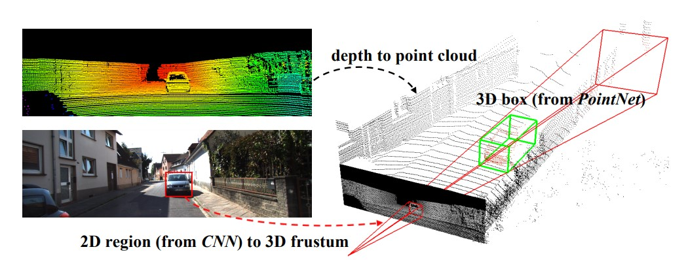
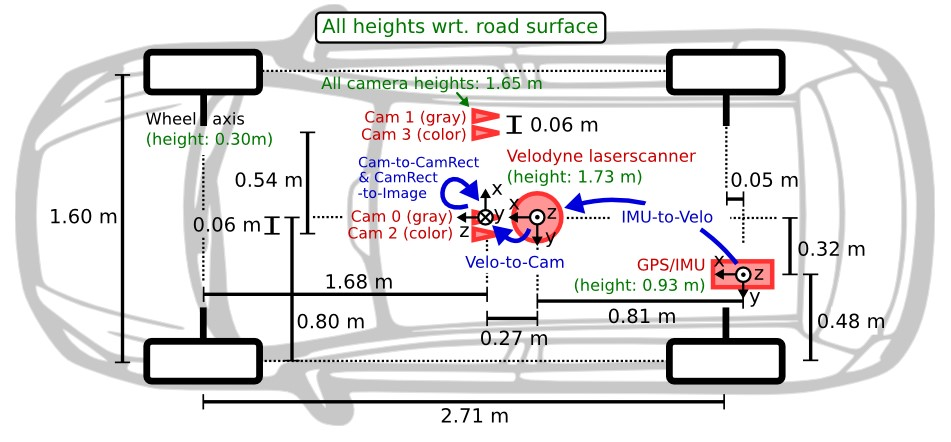
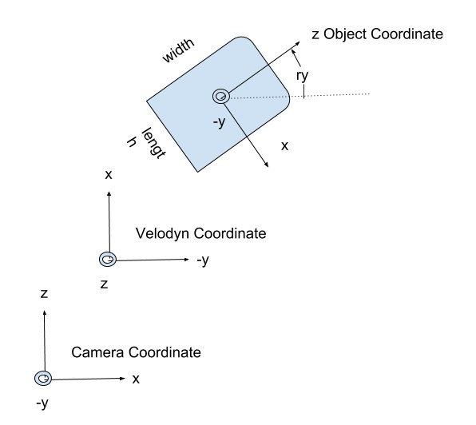
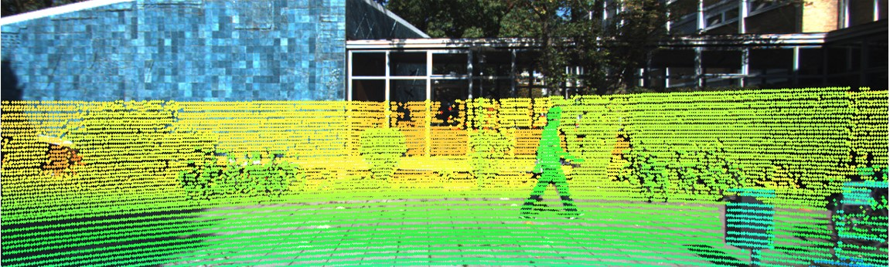
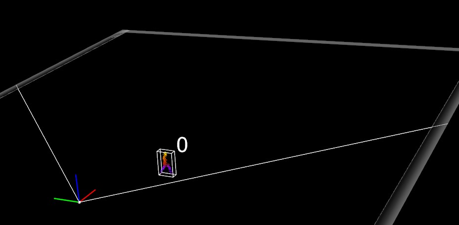
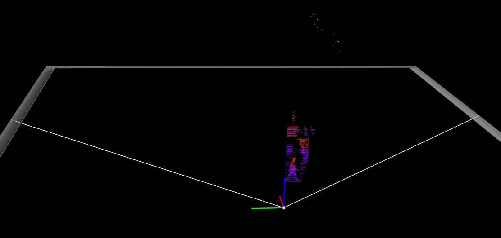

# Frustum Pointnet Implementation for 3D Object Detection Using TF2/Keras
> The entire repository further helps us to implement point clouds and create a custom object detecter which can be later scaled to detect objects specially for autonomous vehicle based applications.

> Live demo [_here_](https://www.example.com). <!-- If you have the project hosted somewhere, include the link here. -->

## Table of Contents
* [General Info](#general-information)
* [Technologies Used](#technologies-used)
* [Features](#features)
* [Screenshots](#screenshots)
* [Setup](#setup)
* [Dataset Utilized](#dataset-utilized)
* [Usage](#usage)
* [Project Status](#project-status)
* [Room for Improvement](#room-for-improvement)
* [References](#references)
* [Acknowledgements](#acknowledgements)
* [Contact](#contact)
<!-- * [License](#license) -->

## General Information
- The aim of this repository is to implement Frustum Pointnets on readily available 3d KITTI as well as Lyft datasets.
- Understand Pointnet Architecture and develop POC around research papers from main authors of Frustum Pointnet.
- Implement Frustum Pointnet for developing a 3d object detector.

This repository is code release for CVPR 2018 paper (arXiv report [here](https://arxiv.org/abs/1711.08488)). In this work, study of 3D object detection from RGB-D data was performed. The authors propose a novel detection pipeline that combines both mature 2D object detectors and the state-of-the-art 3D deep learning techniques. In this pipeline, first thing is to build object proposals with a 2D detector running on RGB images, where each 2D bounding box defines a 3D frustum region. Then based on 3D point clouds in those frustum regions, 3D instance segmentation is achieved and amodal 3D bounding box estimation, using PointNet/PointNet++ networks (see references at bottom).

By leveraging 2D object detectors, we greatly reduce 3D search space for object localization. The high resolution and rich texture information in images also enable high recalls for smaller objects like pedestrians or cyclists that are harder to localize by point clouds only. By adopting PointNet architectures, we are able to directly work on 3D point clouds, without the necessity to voxelize them to grids or to project them to image planes. Since the paper directly work on point clouds, they are able to fully respect and exploit the 3D geometry -- one example is the series of coordinate normalizations that authors apply, which help canocalizes the learning problem. They have further evaluated this approach on KITTI and SUNRGBD benchmarks, and this system significantly outperforms previous state of the art and is still in leading positions on current <a href="http://www.cvlibs.net/datasets/kitti/eval_object.php?obj_benchmark=3d">KITTI leaderboard</a>.

<!-- You don't have to answer all the questions - just the ones relevant to your project. -->

## Technologies Used
- Tensorflow2
- Keras

## Features
List the ready features here:
- Preprocess KITTI Dataset - In Progress
- Train Frustum Poitnnet on KITTI Dataset - Not Yet Started
- Inference Script on KITTI Dataset - Not Yet Started
- Preprocess Lyft Dataset - In Progress
- Train Frustum Poitnnet on Lyft Dataset - Not Yet Started
- Inference Script on Lyft Dataset - Not Yet Started

## Screenshots

## Setup:
- git clone https://github.com/ManashJKonwar/IP-Pointnet-ObjectDetection.git (Clone the repository)
- python3 -m venv IPPointnetODVenv (Create virtual environment from existing python3)
- activate the "IPPointnetODVenv" (Activating the virtual environment)
- pip install -r requirements.txt (Install all required python modules)

## Dataset Utilized:
- [KITTI 3d Object Detector](http://www.cvlibs.net/datasets/kitti/eval_object.php?obj_benchmark=3d)
Credit goes to [KITTI dataset](http://www.cvlibs.net/datasets/kitti/)
The 3D object detection benchmark consists of 7481 training images and 7518 test images as well as the corresponding point  
clouds, comprising a total of 80.256 labeled objects  

One of the best way to understand this data is to understand the sensor layout on the dataset accumulating vehicle which was used by KITTI

Both Training and Testing Dataset are broken into 4 parts-  
1. camera_2_image(.png) - This is a png image file captured by the camera
2. camera_2_label(.txt) - This is a text file containing label and coordinate configuration for objects within the camera image having same naming convention under camera_2_image. Each row of this file is an object and it contains 15 values including the object tag (Car, Pedestrain, Cyclist, etc). The 2D bounding boxes are in terms of pixels in the camera image. The 3D bounding boxes are in 2 co-ordinates. The size (height, weight, and length) are in the object co-ordinate, and the center on the bounding box is in the camera co-ordinate.

Please see below table for details on these 15 parameters  
| Parameter Nos  | Parameter Name    | Parameter Description     |
| :---           | :---              | :---                      |
| 1              | type              | Describes the type of object: 'Car', 'Van', 'Truck', 'Pedestrian', 'Person_sitting', 'Cyclist', 'Tram', 'Misc' or 'DontCare' |
| 1              | truncated         | Float from 0 (non-truncated) to 1 (truncated), where truncated refers to the object leaving image boundaries |
| 1              | occluded          | Integer (0,1,2,3) indicating occlusion state: 0 = fully visible, 1 = partly occluded 2 = largely occluded, 3 = unknown |
| 1              | alpha             | Observation angle of object, ranging [-pi..pi] |
| 4              | bbox              | 2D bounding box of object in the image (0-based index): contains left, top, right, bottom pixel coordinates |
| 3              | dimensions        | 3D object dimensions: height, width, length (in meters) |
| 3              | location          | 3D object location x,y,z in camera coordinates (in meters) |
| 1              | rotation_y        | Rotation ry around Y-axis in camera coordinates [-pi..pi] |
| 1              | score             | Only for results: Float, indicating confidence in detection, needed for p/r curves, higher is better. |

3. calibration(.txt) - There are in total 7 parameters in this file.  
P0, P1, P2, P3, R0_rect, Tr_velo_to_cam, Tr_imu_to_velo
4. velodyne point cloud (.bin) 

- [Lyft Dataset](http://3dvision.princeton.edu/projects/2014/3DShapeNets/)
XXXXX

## Usage
### For Training PointNet:
- python train_OD.py "kitti"
- python train_OD.py "lyft"

### KITTI Frustum Extraction:
Step 1: Visualizing 2d box based object detection

Step 2: Point Cloud Projection on rgb image

Step 3: Lidar 3d Point Cloud Projection

Step 4: Lidar 3d Point Cloud box based object detection

Step 5: Lidar 3d frustum extraction for object

## Project Status
Project is: __in progress_ 
<!-- / _complete_ / _no longer being worked on_. If you are no longer working on it, provide reasons why._ -->

## Room for Improvement
Room for improvement:
- Develop frontend to visualize diffrent frames from datasets
- Provide support for CPUs, GPUs and TPUs as well

To do:
- Finish KIITI dataset operation.

## References
[1] PointNet: Deep Learning on Point Sets for 3D Classification and Segmentation; Charles R. Qi, Hao Su, Kaichun Mo, Leonidas J. Guibas;
CVPR 2017; https://arxiv.org/abs/1612.00593.  
[2] Frustum PointNets for 3D Object Detection from RGB-D Data; Charles R. Qi, Wei Liu, Chenxia Wu, Hao Su, Leonidas J. Guibas; https://arxiv.org/abs/1711.08488

## Acknowledgements

## Contact
Created by [@ManashJKonwar](https://github.com/ManashJKonwar) - feel free to contact me!

<!-- Optional -->
<!-- ## License -->
<!-- This project is open source and available under the [... License](). -->

<!-- You don't have to include all sections - just the one's relevant to your project -->
